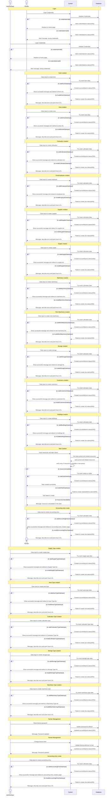

```mermaid
sequenceDiagram
actor Administrator
actor Farmer
participant System
participant Database

Note over Administrator, Database: Login
 Farmer->>System: Login Credentials
 System->>Database: Validate Credentials
 alt is credentialsValid
  Database-->>System: Valid credentials(res.status(200))
  System-->>Farmer: Redirect to home page.
 else is credentialsInvalid
  Database-->>System: Valid credentials(res.status(409))
  System-->>Farmer: Alert message: wrong credentials.
 end

 Administrator->>System: Login Credentials
 System->>Database: Validate Credentials
 alt is credentialsValid
  Database-->>System: Valid credentials(res.status(200))
  System-->>Administrator: Redirect to home page.
 else is credentialsInvalid
  Database-->>System: Valid credentials(res.status(409))
  System-->>Administrator: Alert message: wrong credentials.
 end

Note over Farmer, Database: Farm creation
 Farmer->>System: Data input to create farm
 System->>Database: Try insert farm data
 alt is validFarmDataInput
 Database-->>System: Created succesfully(res.status(200))
 System-->>Farmer: Show successful message and redirect to farms list.
 else is invalidFarmDataInput
 Database-->>System: Failed to create (res.status(409))
 System-->>Farmer: Message: describe error and point how to fix.
 end

Note over Farmer, Database: Area creation
 Farmer->>System: Data input to create area
 System->>Database: Try insert area data
 alt is validAreaDataInput
 Database-->>System: Created succesfully(res.status(200))
 System-->>Farmer: Show successful message and redirect to areas list.
 else is invalidAreaDataInput
 Database-->>System: Failed to create (res.status(409))
 System-->>Farmer: Message: describe error and point how to fix.
 end

Note over Farmer, Database: Cultivation creation
 Farmer->>System: Data input to create cultivation
 System->>Database: Try insert cultivation data
 alt is validCultivationDataInput
 Database-->>System: Created succesfully(res.status(200))
 System-->>Farmer: Show successful message and redirect to cultivation list.
 else is invalidCultivationDataInput
 Database-->>System: Failed to create (res.status(409))
 System-->>Farmer: Message: describe error and point how to fix.
 end

Note over Farmer, Database: FarmEmployee creation
 Farmer->>System: Data input to create employee
 System->>Database: Try insert cultivation data
 alt is validEmployeeDataInput
 Database-->>System: Created succesfully(res.status(200))
 System-->>Farmer: Show successful message and redirect to employee list.
 else is invalidEmployeeDataInput
 Database-->>System: Failed to create (res.status(409))
 System-->>Farmer: Message: describe error and point how to fix.
 end

Note over Farmer, Database: Supplier creation
 Farmer->>System: Data input to create supplier
 System->>Database: Try insert cultivation data
 alt is validSupplierDataInput
 Database-->>System: Created succesfully(res.status(200))
 System-->>Farmer: Show successful message and redirect to supplier list.
 else is invalidSupplierDataInput
 Database-->>System: Failed to create (res.status(409))
 System-->>Farmer: Message: describe error and point how to fix.
 end

Note over Farmer, Database: Supply creation
 Farmer->>System: Data input to create supply
 System->>Database: Try insert cultivation data
 alt is validSupplyDataInput
 Database-->>System: Created succesfully(res.status(200))
 System-->>Farmer: Show successful message and redirect to supply list.
 else is invalidSupplyDataInput
 Database-->>System: Failed to create (res.status(409))
 System-->>Farmer: Message: describe error and point how to fix.
 end

Note over Farmer, Database: Machinery creation
 Farmer->>System: Data input to create machinery
 System->>Database: Try insert cultivation data
 alt is validMachineryDataInput
 Database-->>System: Created succesfully(res.status(200))
 System-->>Farmer: Show successful message and redirect to machinery list.
 else is invalidMachineryDataInput
 Database-->>System: Failed to create (res.status(409))
 System-->>Farmer: Message: describe error and point how to fix.
 end

Note over Farmer, Database: Rent Machinery creation
 Farmer->>System: Data input to create rent machinery
 System->>Database: Try insert cultivation data
 alt is validRentMachineryDataInput
 Database-->>System: Created succesfully(res.status(200))
 System-->>Farmer: Show successful message and redirect to rent machinery list.
 else is invalidRentMachineryDataInput
 Database-->>System: Failed to create (res.status(409))
 System-->>Farmer: Message: describe error and point how to fix.
 end

Note over Farmer, Database: Storage creation
 Farmer->>System: Data input to create storage
 System->>Database: Try insert cultivation data
 alt is validStorageDataInput
 Database-->>System: Created succesfully(res.status(200))
 System-->>Farmer: Show successful message and redirect to storage list.
 else is invalidStorageDataInput
 Database-->>System: Failed to create (res.status(409))
 System-->>Farmer: Message: describe error and point how to fix.
 end

Note over Farmer, Database: Customers creation
 Farmer->>System: Data input to create customers
 System->>Database: Try insert cultivation data
 alt is validCustomersDataInput
 Database-->>System: Created succesfully(res.status(200))
 System-->>Farmer: Show successful message and redirect to customers list.
 else is invalidCustomersDataInput
 Database-->>System: Failed to create (res.status(409))
 System-->>Farmer: Message: describe error and point how to fix.
 end

Note over Farmer, Database: Buildings creation
 Farmer->>System: Data input to create buildings
 System->>Database: Try insert cultivation data
 alt is validBuildingsDataInput
 Database-->>System: Created succesfully(res.status(200))
 System-->>Farmer: Show successful message and redirect to buildings list.
 else is invalidBuildingsDataInput
 Database-->>System: Failed to create (res.status(409))
 System-->>Farmer: Message: describe error and point how to fix.
 end

Note over Farmer, Database: Task Creation
 Farmer->>System: Insert resources and date values
 System->>Database: Get tasks period and related resources
 Database-->>System: tasks period and related resources
 System->>System: verify entry if resources is available in that period
 alt is resourcesAvailable
  System->>Database: Try insert values on table
  alt is validTaskDataInput
   Database-->>System: Created succesfully(res.status(200))
   System-->>Farmer: Task created succesfully
  else is invalidTaskDataInput
   Database-->>System: Failed to create duplicated(res.status(409))
   System-->>Farmer: Task failed to create.
 end
 else is resourcesUnavailable
  System-->>Farmer: Message: resources unavailable in this date
end

Note over Farmer, Database: Accounting entry create
 Farmer->>System: Data input to create accounting entry
 System->>Database: Try insert cultivation data
 alt is validAccountingEntryDataInput
 Database-->>System: Created succesfully(res.status(200))
 System-->>Farmer: Show successful message and redirect to accounting entry creation page.
 else is invalidAccountingEntryDataInput
 Database-->>System: Failed to create (res.status(409))
 System-->>Farmer: Message: describe error and point how to fix.
 end

destroy Farmer
Farmer-xFarmer:

Note over Administrator, Database: Supply Type creation
 Administrator->>System: Data input to create supply type
 System->>Database: Try insert supply type data
 alt is validSupplyTypeDataInput
 Database-->>System: Created succesfully(res.status(200))
 System-->>Administrator: Show successful message and redirect to Supply Type list.
 else is invalidSupplyTypeDataInput
 Database-->>System: Failed to create (res.status(409))
 System-->>Administrator: Message: describe error and point how to fix.
 end

Note over Administrator, Database: Area Type creation
 Administrator->>System: Data input to create area type
 System->>Database: Try insert area type data
 alt is validAreaTypeDataInput
 Database-->>System: Created succesfully(res.status(200))
 System-->>Administrator: Show successful message and redirect to Area Type list.
 else is invalidAreaTypeDataInput
 Database-->>System: Failed to create (res.status(409))
 System-->>Administrator: Message: describe error and point how to fix.
 end

Note over Administrator, Database: Cultivation Type creation
 Administrator->>System: Data input to create cultivation type
 System->>Database: Try insert cultivation type data
 alt is validCultivationTypeDataInput
 Database-->>System: Created succesfully(res.status(200))
 System-->>Administrator: Show successful message and redirect to Cultivation Type list.
 else is invalidCultivationTypeDataInput
 Database-->>System: Failed to create (res.status(409))
 System-->>Administrator: Message: describe error and point how to fix.
 end

Note over Administrator, Database: Storage Type creation
 Administrator->>System: Data input to create storage type
 System->>Database: Try insert storage type data
 alt is validStorageTypeDataInput
 Database-->>System: Created succesfully(res.status(200))
 System-->>Administrator: Show successful message and redirect to Storage Type list.
 else is invalidStorageTypeDataInput
 Database-->>System: Failed to create (res.status(409))
 System-->>Administrator: Message: describe error and point how to fix.
 end

Note over Administrator, Database: Machinery Type creation
 Administrator->>System: Data input to create machinery type
 System->>Database: Try insert machinery type data
 alt is validMachineryTypeDataInput
 Database-->>System: Created succesfully(res.status(200))
 System-->>Administrator: Show successful message and redirect to Machinery Type list.
 else is invalidMachineryTypeDataInput
 Database-->>System: Failed to create (res.status(409))
 System-->>Administrator: Message: describe error and point how to fix.
 end

Note over Administrator, Database: Farmer Management
 Administrator->>System: Reset farmer password
 System->>Database: Update password to default
 Database-->>System: Updated succesfully(res.status(200))
 System-->>Administrator: Message: Password updated

Note over Administrator, Database: Farmer Management
 Administrator->>System: Change licence level
 System->>Database: Update licence premium to true
 Database-->>System: Updated succesfully(res.status(200))
 System-->>Administrator: Message: Password updated

Note over Administrator, Database: Accounting entry create
 Administrator->>System: Data input to create accounting entry
 System->>Database: Try insert cultivation data
 alt is validAccountingEntryDataInput
 Database-->>System: Created succesfully(res.status(200))
 System-->>Administrator: Show successful message and redirect to accounting entry creation page.
 else is invalidAccountingEntryDataInput
 Database-->>System: Failed to create (res.status(409))
 System-->>Administrator: Message: describe error and point how to fix.
 end

```
